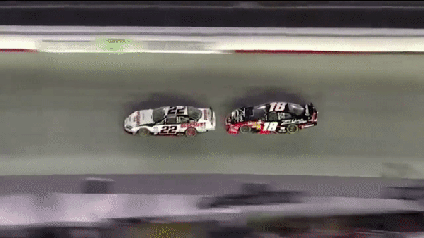

# Detecting NASCAR with YOLO


## The Objective

``` plain
Objects (cars in this case) can be detected and 
identified by the number on the side by extrapolating 
images of Nascar photos from the web and training the 
framework to produce a weights and voc file.  Using 
this video as a guide, generate the scripting files 
and output files necessary to detect the cars and 
numbers on the side, and demonstrate by using a python 
yolo implementation as seen in here and the supporting 
series of videos if possible and not over complicated 
and time consuming:

https://www.youtube.com/watch?v=eFJOGsQ_YTA

Use the following video, or use a similar one online:

https://www.youtube.com/watch?v=B6j-FNfQTvM
```

## Approach

### About Yolo

For this system that will detect NASCAR stock cars and their numbers, YOLO will be utilized, a real time object detection nueral net. YOLO, or You Only Look Once, applies its neural net to the whole image (once), unlike other models which apply the net to the image at different scale. This allows stronger predications as it can use the context of the whole image to asses predictions.

`TLDR; YOLO is faster than other models because it scans the image once rather than multiple times`

Like other object detection models YOLO requires a dataset to be trained on images of objects to be classified/predicted. These images are accompanied by data that tell the model where exactly in the image the object sits, called annotation. These annotations is almost always done by hand. Once the images are gathered and annotated, the model then trains itself, attempting to learn how to idetify the objects, this process is VERY computationally expense and requires good hardware(specifically video cards). However once the model is trained, only relatively good hardware is required to process video and start object detection. At the end of training, the model will provide a file that the will be used as a guide to detect objects -- these are the weights. Finally once the weights are acquired the model is run, fed the weights and the image/video to processed, and if all goes well, the model will be able to detect the desired object.

YOLO (and the accompanying framework darknet), provide pretrained weights that are trained are large datasets that generally consist of thousands of image per object to be detected.

### About NASCAR

NASCAR is the American association for stock-car racing. A wildy popular sport in America thats holds its place in American iconagraphic culture, from the particullary courful cars, littered with logos of corporate sponsors, but perhaps the most iconic are the emblazoned graphic italasized numbers.

Our target for the model, the number decal, is present in 4 places on a standard stock car: on either door, on the roof, and beside the right headlight (though this one is quite small).

### Generating Dataset

Funny enough, no one has an annotated dataset of number decals in NASCAR. :)

Therefore it is required that images are gathered and then annotated on where the number decals sit in the image.

Gathering images of NASCAR stock cars are as easy as googling images and downloading them. The problem is that models prefer an abundance of images and data, in the order of thousands. Thus individually downloading images is a tedious approach. Instead a scraper is used to request images from Google Image Search from a given query. 

The preffered tool here would be the Python library Google Images Download. The library also has a command line interface, shifting time from scripting to fine tuning search parameters.

#### Crafting the best serach query

It's important that the search that is generated is free of images that are unrelated (or have a high ratio of relevant images to irrelevant images), as the unrelated images will have to be manually removed as not to taint the dataset.

NASCAR regulates how teams are permitted to construct and display the stock cars. The most recent regulation was enacted in 2013 with the Generation 6, or Gen-6, cars. It is important that the stock cars in the images reflect the contemporary image of the stock cars. I've restricted the search to the last 3 years to also ensure that the file and image sizes are larger.

Every year, teams will launch new stock car livery conisiting of new colors, sponsors, and images to be displayed on the car. In NASCAR, this is reffered to as the paint scheme. Fortuntaly the unvieling of a scheme is a significant announcement, and will often generate press with images of the cars.

With all of this considered, the initial search term (which utilizes Google search operators) that was used was:

`nascar schemes (2017 OR 2018 OR 2019)`

While this generated many images with stock cars, many where knocked out and void od any context, something YOLO relies on! Thus the query was finalized by adding `track`(which is a nice meta moment to rely on Google image detection to provide data for our image detection):  

`nascar schemes (2017 OR 2018 OR 2019) track`

This generated many images of contempary stock cars on the track, with very few unrelated images! The only problem is that only around 350 images were found -- orders of magnitude less than what is ideal. :(

Finally, the images were annotated, bringing the total amount of areas of interest to around 700!

With annotation finished, the model is then trained!

The model was trained on an Dell XPS 13 Notebook. Lacking a NVIDIA video card, the model would have to be trained on the CPU, which would mean the training would take much longer.

The model started with an average loss of 107 *(lower is better)*. After 24 hours of training the loss was brought down to 11. This however proved to be unusable; unable to detect at even low thresholds. As a last ditch effort, the model was continued to be trained another 24 hours, which brought the loss down to 2 (which also seems to be the lowest the model was able to achieve).

After 48 hours, the model was able to detect some instances of number decals!

### Results


## Considerations

After learning more about NASCAR than ever have before (I'm more of an F1 person myself :P), it is super sastifying to apply that knowledge to an ML model. That said, if taken further, there are some considerations for approachs and experimentation for imporiving the model.

Inititially I'd be interested in gathering fonts similar to the number decals. Many of the decals are fonts with a fill(usuall white or yellow) and 2 layers of outline (one black, one colored). Thus a script could generate a cropped dataset of randomly skewed and warped numbers with outline and fills randomly assigned to the most common colors, on a random color background. This approach could be an effecient manner to quickly generate large datasets. 

One approach I would interested in would be to purchase and play a NASCAR video game that features a replay feature. This could mean that the dataset could be loaded with decals from a variety of angles, without needing to reserach and watch YouTube videos of NASCAR races. Unlike the generated graphics this could allow the yolo to understand context of decals and thus make guesses based off the orientation of the stock car.

Due to limitations around available hardware, the model was trained soley on number decals. Now that the model is confirmed, in the future it would be added to the COCO dataset (which already is confirmed to detectg cars), and the model would be retrained on a modified COCO dataset to then be able to detect number decals in addition to the range of objects in the COCO dataset

## Constructing, Training, and Testing the Model

### Gather images

In terminal, install `googleimagedownload` 

    `pip install google_images_download`

The downloader needs a reference to a Selemium/Chrome driver. Visit this site and download the driver the matches your installed version of Chrome

    `https://sites.google.com/a/chromium.org/chromedriver/downloads`

In terminal, download images using the following command. *Make sure to append the command with the path to the chrome driver!*

    `googleimagesdownload --keywords "nascar schemes (2017 OR 2018 OR 2019) track" --format jpg --limit 1000 --chromedriver <path>`

*<sup><sub>^These parameters can be passed through a config file, they are laid out here for verbosity</sup></sub>

The images will be downloaded into a new directory `downloads\nascar schemes (2017 OR 2018 OR 2019)`

### Prepping files

The images might contain special charcters that darkflow will not accept. Thus the files will most likely need to renamed. I used Bulk rename utility[https://www.bulkrenameutility.co.uk/Download.php] to trim everything but the number

In the utility, select all the files, and in dialog `Remove (5)`:

    -Dropdown from `crop` and choose `after`
    -In the text entry next to `crop` type in the char `.`
    -Finally check `Sym.`

Verify in the file explorer that the new name will only have the number and file extension. Then bulk rename with the `bulk` button in the corner.

### Annotating Images

Navigate to `Image Scrape` and open `imagescrape.html`, open the images and begin annotating.

Be sure that the `classes.txt` is updated with class names.

after annontation export the images as a VOC; This will generate a file called `bboxes_voc.zip`

### Move data

Create a directory in `darkflow\` called `train`. In `darkflow\train\` create a folder `data` and `Annotations`.
Copy the images into `data`, and unzip `bboxes_voc.zip` into `Annotations`.

### Setup darkflow

Make sure you have OpenCV installed, as well as TensorFlow 1.4!

Download the `tiny-yolo-voc` weights and cfg. The cfg can be found on the yolo website. The weights can be found here https://drive.google.com/drive/folders/0B1tW_VtY7onidEwyQ2FtQVplWEU

Place the cfg file into the `darkflow\cfg` directory and the weight file into the `darkflow\bin` directory

### Train the model!
**Skip this if you already possess custom weights**
*\*the following edited is from darkflow repo*


1. Create a copy of the configuration file `tiny-yolo-voc.cfg` and rename it according to your preference `tiny-yolo-voc-1class.cfg` (It is crucial that you leave the original `tiny-yolo-voc.cfg` file unchanged)

2. In `tiny-yolo-voc-1class.cfg`, change classes in the [region] layer (the last layer) to the number of classes you are going to train for. In our case, classes are set to 1.
    
    ```python
    ...

    [region]
    anchors = 1.08,1.19,  3.42,4.41,  6.63,11.38,  9.42,5.11,  16.62,10.52
    bias_match=1
    classes=1
    coords=4
    num=5
    softmax=1
    
    ...
    ```

3. In `tiny-yolo-voc-1class.cfg`, change filters in the [convolutional] layer (the second to last layer) to num * (classes + 5). In our case, num is 5 and classes are 1 so 5 * (1 + 5) = 30 therefore filters are set to 30.
    
    ```python
    ...

    [convolutional]
    size=1
    stride=1
    pad=1
    filters=30
    activation=linear

    [region]
    anchors = 1.08,1.19,  3.42,4.41,  6.63,11.38,  9.42,5.11,  16.62,10.52
    
    ...
    ```

4. Change `labels.txt` to include the label(s) you want to train on (number of labels should be the same as the number of classes you set in `tiny-yolo-voc-1class.cfg` file). In our case, `labels.txt` will contain 1 label1.

    ```
    numberDecal
    ```
5. Reference the `tiny-yolo-voc-1class.cfg` model when you train.

    `python flow --model cfg/tiny-yolo-voc-1class.cfg --load bin/tiny-yolo-voc.weights --train --annotation train/Annotations --dataset train/data`

If using a GPU add the following flag `--gpu 1.0`

You can also pause and then continue training at a later point using:

    `python flow --train --model cfg/tiny-yolo-voc-1class.cfg --load -1`

#### Assertion Error/Byte Expectation

If you get an error on the lines of:

`AssertionError: expect 44948596 bytes, found 44948600`

you can modify 'offset' in `loader.py` *(line 121)* to the differnce of byte count

### Test/Run the Model

***Double check that darkflow is properly setup with OpenCV and Tensorflow (refer to installation section here: https://github.com/thtrieu/darkflow)***

After quitting training, there will be several files in the `darkflow\ckpt\` directory. Make note of the filename with highest number.

##### Importing/Placing files
Place provided set of `.data`,`.index`,`.profile`,and `.meta` files in `darkflow\ckpt\`. 
Move `.cfg` file to `darkflow\cfg`. 
Move `videoProcess.py` to `darkflow\`. 
Move `labels.txt` to `darkflow\`. 

Place the video to be processed in `darkflow\` and name it `cars.mp4`, or edit the following line in `videoProcess.py`  to reflect the video name

```python
capture = cv2.VideoCapture('cars.mp4')
```

Edit the `load` parameter in the `option` object in `videoProcess.py` to reflect that number. *note: this should be an int not a string*

```python
option = {
    'model': 'cfg/tiny-yolo-voc-1class.cfg',
    'load': 10125,
    'threshold': 0.3,
}
```

Save and run the script

`python videoProcess.py`

This will start the process of prediciting each frame and displaying them in a pop-up window. The framerate will depend on the hardware. Press `q` to quit.

If it is desired to render and save a video, the built-in darkflow function can be used. Adjust parameters as nessecary

`python flow --model cfg/tiny-yolo-voc-1class.cfg --load 10125 --demo cars.mp4 --saveVideo`

This will log predicted bounding boxes, and eventually render and save a video `video.avi` to `darkflow\`
